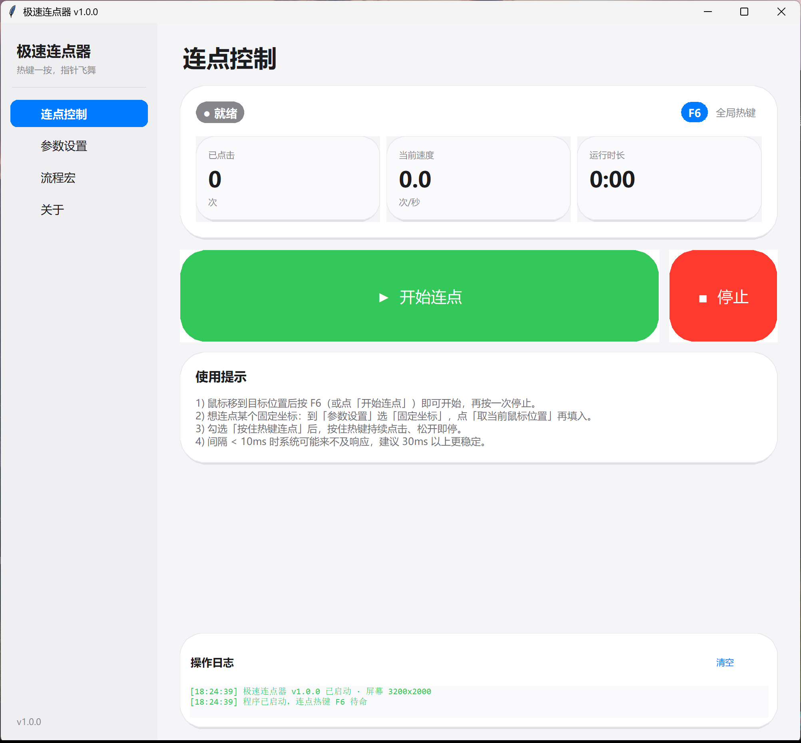
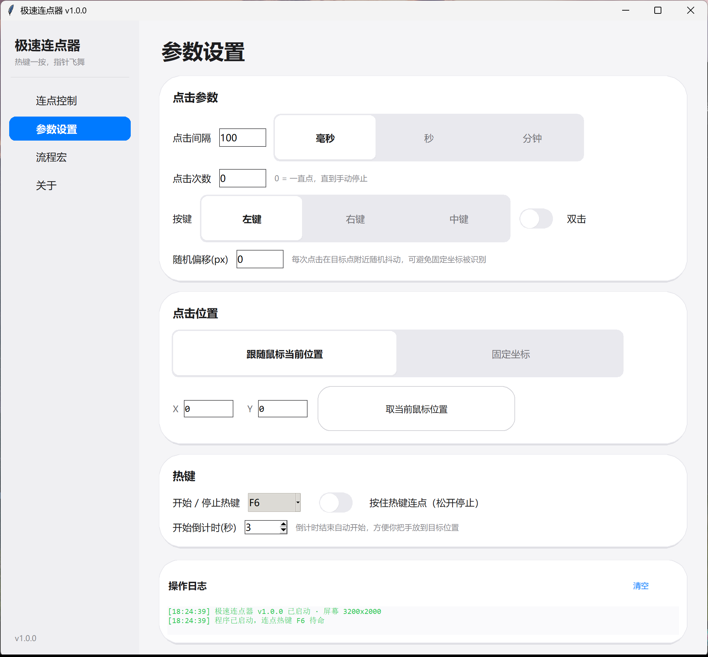
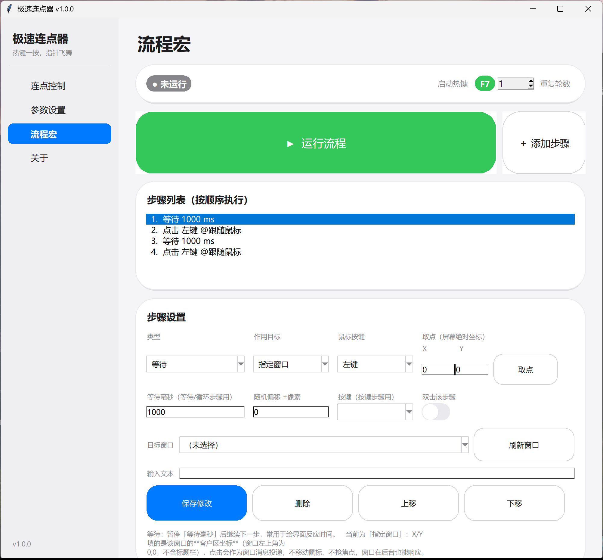

# 极速连点器（AutoClicker）

一个 **独立单文件** 的 Windows 小工具：把鼠标点击自动化。
设定间隔后，热键一按就开始连点；也可以编排**多步骤流程宏**，
并对**任意应用窗口**（含后台窗口）连点。

- 单文件 exe，绿色免安装，双击即用
- 开源协议：**MIT**
- 纯官方 API（`SendInput` / `PostMessage` / `GetAsyncKeyState`），不注入进程、不读写游戏内存
- 完整支持高 DPI（150% / 200% 缩放）

| 连点控制 | 参数设置 | 流程宏 |
| --- | --- | --- |
|  |  |  |

---

## 快速开始

1. 双击 **`极速连点器.exe`**
2. 鼠标移到目标位置
3. 按 **F6**（可改）开始连点，再按一次停止；「开始倒计时」会让你有时间把手放好

下载地址：<https://github.com/xavier111222/AutoClicker/releases/latest>

---

## 功能一览

| 功能 | 说明 |
| --- | --- |
| 点击间隔 | 毫秒 / 秒 / 分钟三档，精度按 `perf_counter` 累加调度，长期运行不漂移 |
| 按键 | 左键 / 右键 / 中键，可选双击 |
| 点击次数 | 指定次数自动停，或 0 = 一直点到手动停止 |
| 位置模式 | 跟随鼠标当前位置，或锁定固定坐标（点「取当前鼠标位置」一键记录） |
| 随机偏移 | 目标点附近 ±N 像素抖动，避免完全固定的坐标 |
| 全局热键 | F1–F12 任选，**切换式**（按一次开始/停止）或**按住式**（按住连点、松开停止） |
| 倒计时 | 0–10 秒，倒计时结束自动开点 |
| 实时统计 | 已点击次数、当前速度（次/秒）、运行时长 |

### 流程宏：把连点升级成「流程」

除了「一直点同一个位置」，还可以编排一串步骤按顺序执行，**每一步都能指定作用目标**：

| 步骤类型 | 说明 |
| --- | --- |
| 点击 / 双击 / 移动 | 鼠标操作，可选左/右/中键 |
| 等待 | 暂停指定毫秒数，给界面反应时间 |
| 输入文本 | 向目标输入一段文字 |
| 按键 | Enter / Ctrl / F5 等常用按键 |
| 循环 | 整个流程重复跑 N 轮（顶部「重复轮数」设置） |

**三种作用目标**——这是跨应用的关键：

| 作用目标 | 机制 | 适用 |
| --- | --- | --- |
| 跟随鼠标 | `SendInput` 合成真实输入 | 游戏、网页等**自绘界面** |
| 固定坐标 | `SendInput` + `SetCursorPos` | 屏幕固定位置 |
| **指定窗口** | `PostMessage` 投递窗口消息 | **任意原生窗口，可后台运行** |

> **「指定窗口」是跨应用连点的核心**：点击以窗口消息直接投递到目标窗口的
> 客户区坐标，**不移动鼠标、不抢焦点**，窗口在后台甚至最小化也能响应。
> 实测可后台点击记事本、文件管理器等原生 Win32 程序。
> 注意：浏览器网页、Unity、Electron 等自绘界面不响应窗口消息，
> 这类程序请用「跟随鼠标」或「固定坐标」。

操作：进入「流程宏」页 → 「刷新窗口」选目标 → 逐条添加/编辑步骤 →
「取点」可一键记录当前鼠标坐标 → 按 **F7** 或点「运行流程」启动。

### 参数怎么选

| 场景 | 建议 |
| --- | --- |
| 常规点击、刷点击类 | 100–200 毫秒，稳定不丢点 |
| 极速点击 | 30–50 毫秒；低于 10ms 系统事件队列会丢包，实际速度上不去 |
| 长挂机 | 1 秒以上 + 指定次数，避免被风控 |
| 固定位置 | 选「固定坐标」+ 取位置，之后鼠标可以移到别处照点 |

---

## 命令行

```bat
极速连点器.exe --version     :: 显示版本
极速连点器.exe --selftest    :: 系统自检（分辨率 / SendInput / DPI 感知）
极速连点器.exe --pos         :: 打印当前鼠标坐标
```

> 打包后的 exe 更容易出「源码能跑、打包就废」的问题，所以务必用 `--selftest` 直接验证 exe。

---

## 它是怎么工作的？

1. **点击**：构造 `INPUT/MOUSEINPUT` 结构体，调 `SendInput` 合成
   `MOUSEEVENTF_*DOWN/UP` 事件 —— 与真实鼠标走同一条系统路径，任何程序都认。
2. **热键**：每 30ms 读一次 `GetAsyncKeyState`（不注册全局热键），
   因此**不注册表、不占用热键、退出即释放**，也不需要管理员权限。
3. **后台点击**：用 `PostMessage` 把 `WM_LBUTTONDOWN/UP` 直接投给目标窗口，
   `lParam` 里打包客户区坐标。选它就不会移动鼠标、不抢焦点。
4. **节拍**：不用 `sleep(interval)` 累加，而是
   `next += interval; wait(next - now)`，避免误差累积导致越点越慢；
   若落后超过 1 秒（系统休眠后）自动重新对时。
5. **UI**：主线程只负责画界面，所有点击在后台线程；线程消息经队列回主线程，
   不直接调 `root.after`（非线程安全，会偶发崩溃）。

---

## ⚠ 注意事项

1. **请遵守你所用软件 / 游戏的服务条款。** 自动化点击可能违反部分游戏规定，
   封号等后果需自行承担。
2. 结束连点：再按一次热键，或点「停止」。直接关窗口也会停止（退出前会清理）。
3. 极短间隔（<10ms）不会更快，只会产生丢点。
4. 首次运行被 SmartScreen 拦截时，点「更多信息 → 仍要运行」（未签名开源程序常见）。
5. 完整支持高 DPI：程序声明 Per-Monitor V2 感知，字体与布局按 DPI 实时缩放。

---

## 从源码运行与构建

```bat
python -m venv .venv
.venv\Scripts\pip install -r requirements.txt

python auto_clicker.py            :: 直接运行源码
.venv\Scripts\python build.py     :: 生成图标 → PyInstaller → 复制到桌面
```

### 项目结构

```
AutoClicker/
├── auto_clicker.py     # 主程序：点击引擎 + GUI + CLI
├── macro.py            # 流程宏引擎：步骤模型 + 顺序执行
├── win_input.py        # Win32 输入层：窗口枚举 / 前台 SendInput / 后台 PostMessage
├── ui_kit.py           # Apple 风格 UI 骨架（高 DPI 安全组件库）
├── make_icon.py        # 生成 assets/icon.ico
├── build.py            # 一键打包并复制到桌面
├── assets/
│   ├── icon.ico
│   └── app.manifest    # Per-Monitor V2 DPI 感知声明
├── docs/               # README 截图
├── requirements.txt
├── LICENSE
└── README.md
```

---

## 常见问题

**Q：按热键没反应？**
A：① 焦点在别的程序上时热键仍然有效，若无效说明热键被其他软件（如游戏热键）抢占，
换一个 F 键试试；② 「按住式」模式要按住不放；③ 有些以管理员身份运行的程序
无法被普通权限程序模拟点击，此时用「获取管理员权限」提权后再试。

**Q：点击速度上不去？**
A：低于 10ms 系统会丢事件，建议 30ms+；另外目标程序自身有处理上限。

**Q：后台点击为什么有的程序没反应？**
A：窗口消息只对「用Win32 消息响应点击」的控件有效（记事本、资源管理器、
Office、部分老程序）。浏览器网页、Unity/Electron 游戏这类自绘界面会忽略
`WM_LBUTTONDOWN`，必须改用「跟随鼠标」或「固定坐标」的前台点击。

**Q：切换到别的程序会不会中断后台连点？**
A：不会，这就是「指定窗口」的意义——你可以一边让程序在后台点，
一边自己用鼠标干别的事。但要注意：如果目标程序自己弹了模态框挡住控件，
点击会落到模态框上。

**Q：会记录我的鼠标操作吗？**
A：不会。程序不读取屏幕内容、不联网上传、不写除日志外的任何文件，日志只在界面底部。

---

## 许可证

MIT，见 [LICENSE](LICENSE)。使用风险自负，作者不对因使用本工具造成的任何后果负责。
